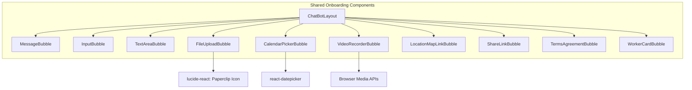

# Onboarding Chat Views Implementation Plan (Frontend-First)

## Overall Goal:
Implement scrollable, chat-like onboarding interfaces for both "Buyers" and "Workers," allowing users to provide information through a series of interactive "chat bubbles." This involves creating all frontend components and page logic, followed by backend API implementation and integration.

## Key Technologies:
*   Next.js (React)
*   CSS Modules
*   Firebase (Authentication, Storage, Firestore, Custom Claims) - Backend phase
*   PostgreSQL (with Drizzle ORM) - Backend phase
*   TypeScript

---

### Phase A: Frontend Core & Specialized Components

**Goal:** Establish all foundational and specialized UI elements for the chat interface.

**Diagram: Component Ecosystem**


**Steps:**

1.  **Prerequisites & Setup (Frontend Focus):**
    *   **Install Dependencies:**
        *   `npm install lucide-react`
        *   `npm install react-datepicker @types/react-datepicker`
    *   **Static Assets:** Ensure `public/images/logo-placeholder.svg` exists.

2.  **Implement Core Bubble Components:**
    *   Create `app/components/onboarding/ChatBotLayout.jsx` & `ChatBotLayout.module.css`.
    *   Create `app/components/onboarding/MessageBubble.jsx` & `MessageBubble.module.css`.
    *   Create `app/components/onboarding/InputBubble.jsx` & `InputBubble.module.css`.
    *   Create `app/components/onboarding/TextAreaBubble.jsx` & `TextAreaBubble.module.css`.
    *   Create `app/components/onboarding/FileUploadBubble.jsx` & `FileUploadBubble.module.css`.

3.  **Implement Specialized Interactive Bubble Components:**
    *   Create `app/components/onboarding/CalendarPickerBubble.jsx` & `CalendarPickerBubble.module.css` (integrating `react-datepicker`).
    *   Create `app/components/onboarding/VideoRecorderBubble.jsx` & `VideoRecorderBubble.module.css` (with basic camera access via `navigator.mediaDevices.getUserMedia()`).
    *   Create `app/components/onboarding/LocationMapLinkBubble.jsx` & `LocationMapLinkBubble.module.css` (with basic map display, e.g., iframe or simple map library integration).
    *   Create `app/components/onboarding/ShareLinkBubble.jsx` & `ShareLinkBubble.module.css` (display link, copy button).
    *   Create `app/components/onboarding/TermsAgreementBubble.jsx` & `TermsAgreementBubble.module.css` (display terms, checkbox).
    *   Create `app/components/onboarding/WorkerCardBubble.jsx` & `WorkerCardBubble.module.css` (display worker info).

---

### Phase B: Frontend Page Logic (Buyer & Worker Onboarding)

**Goal:** Implement the frontend logic for both buyer and worker onboarding pages, using all created components and mocking backend calls.

**Diagram: Page Logic Flow (Generic)**
```mermaid
graph TD
    User --> Page[Onboarding Page .tsx]
    Page --> Hooks[useAppContext, useFirebaseAuth]
    Page --> State[formData, chatMessages, etc.]
    Page --> ChatLayout[ChatBotLayout]
    ChatLayout --> Bubbles[Rendered Bubble Components]
    Bubbles --> PageAction[handleInputChange, handleInputSubmit]
    PageAction --> State
    Page --> MockAPI[Mocked handleFinalSubmit]
    MockAPI -.-> ConsoleLog[Console.log(formData)]
    MockAPI -.-> UserFeedback[Simulate Success/Error UI]
```

**Steps:**

1.  **Implement Buyer Onboarding Page Frontend (`app/onboard-buyer/page.tsx`):**
    *   Use the provided JSX structure from the initial prompt.
    *   Correct import paths for hooks and all components from Phase A.
    *   Implement `OnboardingStep` interface and `initialSteps` array for buyer onboarding.
    *   Implement state management: `formData`, `chatMessages`, `isSubmitting`.
    *   Implement handler functions: `handleInputChange`, `handleInputSubmit`.
    *   **Mock `handleFinalSubmit`:**
        *   Log `formData` to the console.
        *   Simulate API call delay (e.g., `await new Promise(resolve => setTimeout(resolve, 1000));`).
        *   Simulate success (e.g., `router.push('/buyer/dashboard')` or display a success message) or error.
    *   Ensure `chatContainerRef` is correctly passed to `ChatBotLayout`.
    *   Integrate all necessary bubble components based on `initialSteps`.
    *   Implement logic for `allStepsComplete` and conditional rendering of the final submit button.
    *   Include authentication checks using `useAppContext`.
    *   Create `app/onboard-buyer/OnboardBuyerPage.module.css` if needed.
    *   **Update:** Added the QA Mode display div.
    *   **Update:** Added a text input field at the bottom for AI communication. The handler currently logs to console in QA mode and has a TODO for backend integration otherwise.

2.  **Implement Worker Onboarding Page Frontend (`app/onboard-worker/page.tsx`):**
    *   Use the provided JSX structure from the initial prompt.
    *   Correct import paths.
    *   Define `OnboardingStep`, `WorkerFormData` interfaces.
    *   Implement the extensive `initialSteps` array for worker onboarding, including dynamic bot messages.
    *   Implement state management: `formData`, `chatMessages`, `isSubmitting`, `currentFocusedInputName`.
    *   Implement handler functions: `handleInputChange`, `handleInputSubmit`, `handleFileSelected`.
    *   **Mock `handleFinalSubmit`:**
        *   Log `formData` (including file objects) to the console.
        *   Simulate API call delay.
        *   Simulate success (e.g., `router.push('/worker/dashboard')`) or error.
    *   Implement auto-focus logic.
    *   Integrate all bubble components.
    *   Handle `userResponseDisplayStep` logic.
    *   Include authentication checks.
    *   **Update:** Added the QA Mode display div.
    *   **Update:** Added a text input field at the bottom for AI communication. The handler currently logs to console in QA mode and has a TODO for backend integration otherwise.

3.  **Implement Create Gig Page Frontend (`app/create-gig/page.tsx`):**
    *   Use the provided JSX structure from the initial prompt.
    *   Correct import paths.
    *   Define `OnboardingStep`, `WorkerData` interfaces (or relevant Gig interfaces).
    *   Implement the `baseInitialSteps` array for the create gig flow.
    *   Implement state management: `formData`, `chatMessages`, `isSubmitting`, `currentFocusedInputName`, `workerName`, `workerPrice`.
    *   Implement handler functions: `handleInputChange`, `handleInputSubmit`, `handleBookWorker`, `handleFinalSubmitGig`.
    *   **Mock `handleFinalSubmitGig`:**
        *   Log `formData`, `workerName`, `workerPrice` to the console.
        *   Simulate API call delay.
        *   Simulate success or error.
    *   Ensure `chatContainerRef` is correctly passed to `ChatBotLayout`.
    *   Integrate necessary bubble components (MessageBubble, InputBubble, TextAreaBubble, WorkerCard).
    *   Handle `userResponseDisplayStep` logic.
    *   Include authentication checks.
    *   Create `app/create-gig/CreateGigPage.module.css` if needed.
    *   **Update:** Added the QA Mode display div.
    *   **Update:** Added a text input field at the bottom for AI communication. The handler currently logs to console in QA mode and has a TODO for backend integration otherwise.

---

### Phase C: Backend API Implementation (Buyer & Worker)

**Goal:** Implement the backend APIs to persist data collected from the onboarding flows.

**Steps:**

1.  **Verify Drizzle Schemas & Database Setup:**
    *   Ensure your Drizzle schemas in `app/lib/drizzle/schema/` are ready for all buyer and worker data.
    *   Ensure database migrations are up-to-date.

2.  **Implement Buyer Onboarding API (`app/api/buyer/onboard/route.ts`):**
    *   As detailed in the original plan (Phase 3, Step 3):
        *   Handle `POST` requests with JSON.
        *   Firebase ID token authentication.
        *   Data validation.
        *   Drizzle/PostgreSQL operations for `Users` and `BuyerProfiles`.
        *   Optional Firestore updates.
        *   Return JSON response.

3.  **Implement Worker Onboarding API (`app/api/worker/onboard/route.ts`):**
    *   As detailed in the original plan (Phase 4, Step 2):
        *   Handle `POST` requests with `FormData`.
        *   Firebase ID token authentication.
        *   Data validation (text fields, file properties).
        *   File uploads to Firebase Storage.
        *   Drizzle/PostgreSQL operations for `Users`, `GigWorkerProfiles`, `Skills`.
        *   Firestore updates for public worker profile.
        *   Set `isActualGigWorker` Firebase Custom Claim.
        *   Return JSON response.

---

### Phase D: Integration, Testing, and Refinement

**Goal:** Connect the frontend to the actual backend APIs, conduct thorough testing, and refine the user experience.

**Steps:**

1.  **Integrate Frontend with Backend APIs:**
    *   In `app/onboard-buyer/page.tsx`, replace the mocked `handleFinalSubmit` with actual `fetch` calls to `/api/buyer/onboard`.
    *   In `app/onboard-worker/page.tsx`, replace the mocked `handleFinalSubmit` with actual `fetch` calls to `/api/worker/onboard` (sending `FormData`).
    *   In `app/create-gig/page.tsx`, replace the mocked `handleFinalSubmitGig` with actual `fetch` calls to the relevant backend endpoint (e.g., `/api/gig/create`).
    *   **New Task:** Implement backend API endpoint(s) to handle messages from the new input field in all three chat views.
    *   Handle actual API responses (success and error states).

2.  **Component Testing (Review):** Briefly review component behavior now that they are integrated into pages.
3.  **End-to-End Flow Testing (Buyer & Worker):**
    *   Thoroughly test both onboarding flows from start to finish.
    *   Verify data is correctly captured, sent, processed by the API, and stored in PostgreSQL, Firebase Storage, and Firestore.
    *   Verify Firebase Custom Claims are set for workers.
    *   Test file uploads and retrieval (if applicable beyond just storing URLs).
    *   **New Task:** Test sending messages from the new input field and verify backend handling (once implemented).
4.  **Error Handling & Edge Cases:** Test various error scenarios (network issues, invalid data, API errors).
5.  **UI/UX Review & Refinement:**
    *   Confirm smooth scrolling, chat behavior, auto-focus.
    *   Ensure responsiveness.
    *   Gather feedback if possible.
6.  **Code Review & Refactor:** Review the entire codebase for clarity, efficiency, security, and best practices.